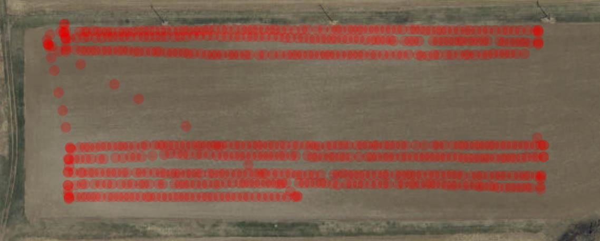

# FlightCheck

FlightCheck is a simple post flight tool to check if the mission was complete, i.e., pictures for all field were saved. It is useful for cases when the sensor capturing images is not directly connected to the flight mission software and there is no guarantee all the images were saved. Our motivation was because some the Micasense RedEdge-3 attached to our DJI Matrice 100 was not saving data - which means no guarantee that after taking off we would have any picture in the end. We usually check our folders after flight, having one idea of how many folders with pictures would be expected. However, we wanted to simplify this task, where we could select the storage device (SD card or pendrive) and look at the GPS position of the pictures.


## Motivation

Here is one example of a flight on spring wheat conducted by the PhD candidate Mei Ling Wong. In this case, we missed the middle part of the flight - after stopping the drone for changing its battery for the first time. 




## Usage 

You can use the shiny app directly from this GitHub repository:

```
runGitHub('FlightCheck','Lachowiec-Lab', ref="main")
```

FlightCheck is very simple to use! Select the folder containing all the images from your flight and give a certain extension for the image data. If you have multispectral information, you can send just one band to FlighCheck. For example, for Micasense sensors, the files end in `*_X.tif`, where `X` is one of the multiple bands (the wildcard `*` means anything before `_`). So, if you want to use just the first band in the software, you can use `*1.tif`.


### Contact

Let us know about any problems or modifications that can be implemented. 

Thank you!!!

fernando[dot]correr[at]montana[dot]edu

